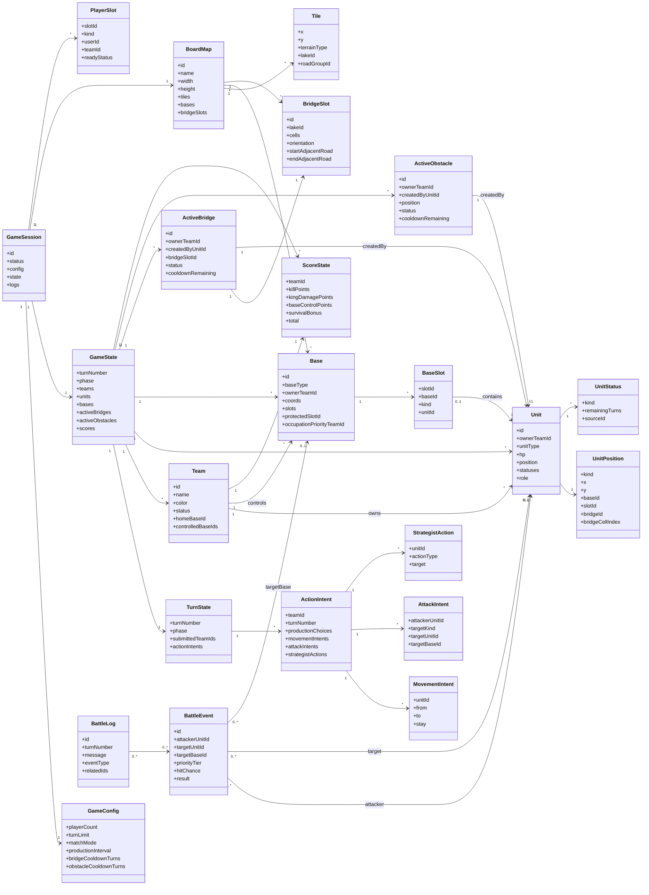

# ドメインモデル図 v0.1

この文書は、戦略陣取りゲームの実装前設計として、主要な「概念」と「関係」を整理したドメインモデル図です。  
Codex などのコード生成エージェントが、ゲーム全体の構造を把握するための資料として使います。

---

# 1. ドメインモデル図とは何か

ドメインモデル図とは、実装対象の世界に登場する主要な概念を洗い出し、それらがどのように関係しているかを表す図です。

このゲームで言えば、以下のような「ゲーム内の概念」を整理します。

- 試合
- プレイヤー/チーム
- 駒
- 拠点
- マップ
- 道/湖/橋
- 障害物
- ターン
- 行動入力
- 戦闘イベント
- 得点

## 1.1 クラス図やER図との違い

| 図 | 目的 |
|---|---|
| ドメインモデル図 | ゲーム世界の概念と関係を整理する |
| クラス図 | 実装上のクラス/型/メソッドまで整理する |
| ER図 | DBテーブルとリレーションを整理する |

この段階では、DB設計やメソッド設計ではなく、「何をデータとして持つべきか」「どの概念がどの概念に所属するか」を明確にします。

---

# 2. 設計方針

- ゲームロジックは2Dグリッド座標で管理する。
- isometric表示は描画専用であり、ドメインモデルには直接入れない。
- 拠点内の駒は通常座標ではなく、拠点内部リストで管理する。
- 橋はマップ上の `BridgeSlot` に設置される。
- 橋・障害物は建設軍師に紐づく。
- 橋/障害物のクールダウンは別管理とする。
- ターン中の入力は `ActionIntent` として保持し、移動解決・戦闘解決で処理する。
- 中立CPU拠点は、プレイヤー代替CPUとは別扱いにする。

---

# 3. ドメインモデル図



---

# 4. 主要概念の説明

## 4.1 GameSession

1試合そのものを表す。

保持するもの:

- 試合ID
- 試合状態
- 設定
- 現在のゲーム状態
- マップ
- 参加枠
- ログ

オンライン化した場合も、1つのルーム/試合に対応する単位として扱える。

## 4.2 GameConfig

試合開始前に決まる設定。

例:

- プレイヤー人数
- 試合形式
- 制限ターン数
- 生産間隔
- 橋クールダウン
- 障害物クールダウン
- マップID

ゲーム中に基本的には変更しない。

## 4.3 GameState

試合中に変化する状態の中心。

保持するもの:

- 現在ターン数
- 現在フェーズ
- チーム一覧
- 駒一覧
- 拠点一覧
- 設置中の橋
- 設置中の障害物
- 得点
- ターン状態

Codex実装では、まず `GameState` を中心に純粋関数で処理するのが安全。

## 4.4 TurnState

現在ターンの入力状況を表す。

同時行動型なので、各チームの入力を `ActionIntent` として集めてから解決する。

## 4.5 Team

ゲーム内の陣営。

ユーザー/CPUとは別に、ゲーム内の陣営として扱う。

## 4.6 PlayerSlot

参加枠。

CPUやオンライン参加待ちを「モード」ではなく、参加枠の種類として扱う。

| kind | 意味 |
|---|---|
| human_local | ローカル人間 |
| human_online | オンライン人間 |
| cpu | CPU |
| open | 募集中 |
| empty | 空き |

## 4.7 BoardMap

マップ定義。

保持するもの:

- タイル一覧
- 拠点一覧
- 橋候補スロット一覧
- 湖ID
- 道グループID

ゲームロジック上のマップは2D座標で持つ。

## 4.8 Tile

通常のマス。

地形種別:

- road
- lake

橋や障害物は静的な `Tile` に直接書き込まず、`ActiveBridge` と `ActiveObstacle` から動的に判定する。

## 4.9 Base

拠点。

保持するもの:

- 拠点ID
- 拠点種別
  - home
  - neutral
  - normal
- 所有者チームID
- 2×2座標
- 内部スロット
- 奥座敷スロットID
- 占拠優先権チームID

拠点内の駒は、通常地上座標ではなく `BaseSlot` で管理する。

## 4.10 BaseSlot

拠点内の収容枠。

スロット例:

- front_1
- front_2
- front_3
- protected

本拠地の場合、`protected` が奥座敷枠となる。

## 4.11 Unit

駒。

保持するもの:

- 駒ID
- 所有チームID
- 兵種
- HP
- 現在位置
- 状態
- 軍師の場合は役割

`Unit` は必ず `UnitPosition` を持つ。

## 4.12 UnitPosition

駒の位置。

| kind | 意味 |
|---|---|
| tile | 通常地上マス |
| water | 水面上 |
| base | 拠点内 |
| bridge | 橋上 |
| removed | 撃破/除去済み |

リプレイやログを考えるなら、撃破済み駒を削除せず `removed` 状態として残す方が扱いやすい。

## 4.13 UnitStatus

駒に付く一時状態。

例:

| status | 意味 |
|---|---|
| retreating | 撤退中 |
| encouraged | 鼓舞中 |
| cannot_attack | 攻撃不可 |

撤退中は全兵種に発生し得る共通状態。  
ただし、歩兵のみ防御補正を得る。

## 4.14 ActiveBridge

現在設置中の橋。

保持するもの:

- 所有チームID
- 作成した建設軍師ID
- 使用している `BridgeSlot`
- 状態
  - none
  - active
  - cooldown
- クールダウン残りターン

橋そのものの形は `BridgeSlot` が持つ。  
`ActiveBridge` は「どのチームがどの橋候補を使っているか」を表す。

## 4.15 BridgeSlot

マップ上で橋を架けられる候補。

保持するもの:

- 湖ID
- 橋セル座標一覧
- 縦/横
- 始点側の隣接道
- 終点側の隣接道

橋は自由生成ではなく、マップ側に定義された `BridgeSlot` の中から選ぶ。

## 4.16 ActiveObstacle

現在設置中の障害物。

保持するもの:

- 所有チームID
- 作成した建設軍師ID
- 位置
- 状態
- クールダウン残りターン

橋上に設置されている場合、位置は `bridge` または該当座標として表す。  
橋が消滅した場合、その橋上の障害物も消滅する。

## 4.17 ActionIntent

各チームが1ターン中に入力した行動予定。

含むもの:

- 生産選択
- 移動予定
- 攻撃対象選択
- 軍師アクション

同時行動ゲームなので、入力をすぐ反映せず、フェーズ解決時にまとめて処理する。

## 4.18 MovementIntent

移動予定。

- 駒ID
- 移動前位置
- 移動先位置
- 移動しないか

解決時に合法性を再判定する。

## 4.19 AttackIntent

攻撃予定。

- 攻撃する駒
- 攻撃対象
- 対象が駒か拠点か
- 拠点攻撃の場合、拠点内のどの駒を狙うか

## 4.20 StrategistAction

軍師アクション。

想定:

- placeBridge
- resetBridge
- placeObstacle
- resetObstacle
- teleportUnit

鼓舞はパッシブ扱いのため、Action にしない可能性が高い。

## 4.21 BattleEvent

戦闘解決時に生成される攻撃イベント。

保持するもの:

- 攻撃者
- 対象
- 対象拠点
- 優先階層
- 命中率
- 結果

攻撃イベントに変換してから優先階層ごとに解決する。

## 4.22 BattleLog

表示/検証用ログ。

例:

- 水計
- 橋消滅
- 拠点攻撃
- 王撃破
- 撤退解除
- 中立拠点制圧

---

# 5. Codex向け実装メモ

## 5.1 最初に実装すべき中心型

```ts
type GameState = {
  turnNumber: number;
  phase: TurnPhase;
  teams: Team[];
  units: Unit[];
  bases: Base[];
  activeBridges: ActiveBridge[];
  activeObstacles: ActiveObstacle[];
  scores: ScoreState[];
  turnState: TurnState;
};
```

## 5.2 駒位置型

```ts
type UnitPosition =
  | { kind: "tile"; x: number; y: number }
  | { kind: "water"; x: number; y: number }
  | { kind: "base"; baseId: string; slotId: string }
  | { kind: "bridge"; bridgeId: string; cellIndex: number }
  | { kind: "removed"; reason: "defeated" | "water_trap" | "king_defeat_reset" };
```

## 5.3 兵種型

```ts
type UnitType =
  | "king"
  | "infantry"
  | "cavalry"
  | "archer"
  | "engineer"
  | "ninja"
  | "apprentice_ninja"
  | "strategist";
```

## 5.4 軍師役割型

```ts
type StrategistRole =
  | "encourage"
  | "builder"
  | "teleporter";
```

## 5.5 状態型

```ts
type UnitStatusKind =
  | "retreating"
  | "encouraged"
  | "cannot_attack";
```

撤退中は全兵種に発生し得る。  
ただし、防御補正は歩兵のみ。

## 5.6 橋と障害物

```ts
type ActiveBridge = {
  id: string;
  ownerTeamId: string;
  createdByUnitId: string;
  bridgeSlotId: string | null;
  status: "none" | "active" | "cooldown";
  cooldownRemaining: number;
};
```

```ts
type ActiveObstacle = {
  id: string;
  ownerTeamId: string;
  createdByUnitId: string;
  position: UnitPosition | null;
  status: "none" | "active" | "cooldown";
  cooldownRemaining: number;
};
```

## 5.7 実装上の注意

- `Tile` に橋や障害物を直接書き込まず、`activeBridges` と `activeObstacles` から動的に通行可否を判定する。
- 拠点内の駒を通常座標に置かない。
- 本拠地奥座敷は `BaseSlot.kind = "protected"` で表す。
- 橋リセット後は即再設置しない。5ターンクールダウンに入る。
- 橋と障害物のクールダウンは別管理。
- `ActionIntent` は入力情報であり、解決前にゲーム状態へ反映しない。
- 移動候補や射程は2Dグリッド座標で計算する。
- isometric表示座標をロジックに使わない。

---

# 6. 未確定/TBD

| 項目 | 状態 |
|---|---|
| 得点計算の最終式 | TBD |
| 転送軍師の移動可能範囲詳細 | TBD |
| 攻撃イベント階層の最終仕様 | 暫定 |
| 生産上限の最終値 | 暫定 |
| CPUプレイヤーの意思決定モデル | TBD |
| DB保存形式 | オンライン化時に検討 |
| API設計 | オンライン化時に検討 |
