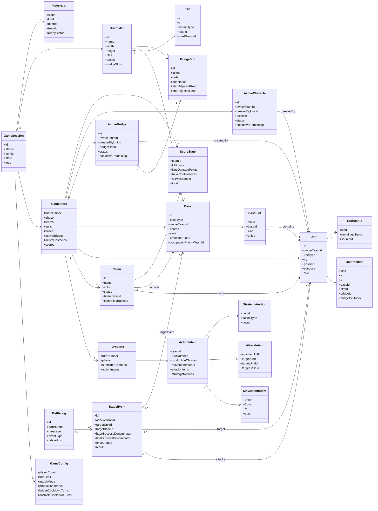

# ドメインモデル図 v0.1

この文書は、戦略陣取りゲームの実装前設計として、主要な「概念」と「関係」を整理したドメインモデル図です。  
Codex などのコード生成エージェントが、ゲーム全体の構造を把握するための資料として使います。

---

## Phase 3-A: Retreat State Additions

`GameState` keeps `unitTurnFlags` as machine-readable per-turn flags derived from the previous battle.
These flags are not parsed from logs and are cleared after movement resolution.

```ts
type UnitTurnFlags = {
  unitId: string;
  battleTurnNumber: number;
  wasAliveAtBattleStart: boolean;
  survivedPreviousBattle: boolean;
  attackedInPreviousBattle: boolean;
  wasTargetedInPreviousBattle: boolean;
  retreatEligible: boolean;
};
```

`UnitStatus.kind = "retreating"` is the active retreat marker.
Retreat eligibility is separate from `UnitStatus`; eligibility means the next legal movement toward the nearest friendly controlled base can start retreat.
Retreating units cannot attack, but can be attacked normally.
Phase 3-A does not add retreat defense probability changes.

`unitTurnFlags` also records battle-time retreat diagnostics such as `positionAtBattleStart`, `enemyBaseDistanceAtBattleStart`, `enemyBaseWithin3AtBattleStart`, and `retreatEligibilityReason`.
The retreat eligibility participant set comes from valid BattleEvents before hit resolution, so both attackers and targets count even when the attack misses.
Enemy controlled bases are resolved from enemy teams' `controlledBaseIds` plus their home-owned bases.

# 1. ドメインモデル図とは何か

ドメインモデル図とは、実装対象の世界に登場する主要な概念を洗い出し、それらがどのように関係しているかを表す図です。

このゲームで言えば、以下のような「ゲーム内の概念」を整理します。

- 試合
- プレイヤー/チーム
- 駒
- 拠点
- マップ
- 道/湖/橋
- 障害物
- ターン
- 行動入力
- 戦闘イベント
- 得点

## 1.1 クラス図やER図との違い

| 図 | 目的 |
|---|---|
| ドメインモデル図 | ゲーム世界の概念と関係を整理する |
| クラス図 | 実装上のクラス/型/メソッドまで整理する |
| ER図 | DBテーブルとリレーションを整理する |

この段階では、DB設計やメソッド設計ではなく、「何をデータとして持つべきか」「どの概念がどの概念に所属するか」を明確にします。

---

# 2. 設計方針

- ゲームロジックは2Dグリッド座標で管理する。
- isometric表示は描画専用であり、ドメインモデルには直接入れない。
- 拠点内の駒は通常座標ではなく、拠点内部リストで管理する。
- 橋はマップ上の `BridgeSlot` に設置される。
- 橋・障害物は建設軍師に紐づく。
- 橋/障害物のクールダウンは別管理とする。
- ターン中の入力は `ActionIntent` として保持する。移動Intentは現在担当チーム分を確定時に即時解決し、攻撃Intentは全チーム分を収集して同時戦闘解決する。
- 中立CPU拠点は、プレイヤー代替CPUとは別扱いにする。

---

# 3. ドメインモデル図



---

# 4. 主要概念の説明

## 4.1 GameSession

1試合そのものを表す。

保持するもの:

- 試合ID
- 試合状態
- 設定
- 現在のゲーム状態
- マップ
- 参加枠
- ログ

オンライン化した場合も、1つのルーム/試合に対応する単位として扱える。

## 4.2 GameConfig

試合開始前に決まる設定。

例:

- プレイヤー人数
- 試合形式
- 制限ターン数
- 生産間隔
- 橋クールダウン
- 障害物クールダウン
- マップID

ゲーム中に基本的には変更しない。

## 4.3 GameState

試合中に変化する状態の中心。

保持するもの:

- 現在ターン数
- 現在フェーズ
- チーム一覧
- 駒一覧
- 拠点一覧
- 設置中の橋
- 設置中の障害物
- 得点
- ターン状態

Codex実装では、まず `GameState` を中心に純粋関数で処理するのが安全。

## 4.4 TurnState

現在ターンの入力状況を表す。

移動では現在担当チームの `ActionIntent.movementIntents` だけを集めて即時解決し、盤面・拠点所有権・撤退状態を更新してから次チームへ進む。攻撃、生産、建設軍師アクションは各既存フェーズの同時解決方式を維持する。

## 4.5 Team

ゲーム内の陣営。

ユーザー/CPUとは別に、ゲーム内の陣営として扱う。

## 4.6 PlayerSlot

参加枠。

CPUやオンライン参加待ちを「モード」ではなく、参加枠の種類として扱う。

| kind | 意味 |
|---|---|
| human_local | ローカル人間 |
| human_online | オンライン人間 |
| cpu | CPU |
| open | 募集中 |
| empty | 空き |

## 4.7 BoardMap

マップ定義。

保持するもの:

- タイル一覧
- 拠点一覧
- 橋候補スロット一覧
- 湖ID
- 道グループID

ゲームロジック上のマップは2D座標で持つ。

## 4.8 Tile

通常のマス。

地形種別:

- road
- lake

橋や障害物は静的な `Tile` に直接書き込まず、`ActiveBridge` と `ActiveObstacle` から動的に判定する。

## 4.9 Base

拠点。

保持するもの:

- 拠点ID
- 拠点種別
  - home
  - neutral
  - normal
- 所有者チームID
- 2×2座標
- 内部スロット
- 奥座敷スロットID
- 占拠優先権チームID

拠点内の駒は、通常地上座標ではなく `BaseSlot` で管理する。

## 4.10 BaseSlot

拠点内の収容枠。

スロット例:

- front_1
- front_2
- front_3
- protected

本拠地の場合、`protected` が奥座敷枠となる。

## 4.11 Unit

駒。

保持するもの:

- 駒ID
- 所有チームID
- 兵種
- HP
- 現在位置
- 状態
- 軍師の場合は役割

`Unit` は必ず `UnitPosition` を持つ。
初期配置される各チームの軍師は、Humanならプレイヤー構成設定、Random CPUならseed付きの決定的なランダム選択によって `role` を確定する。王は本拠地のprotected slotに配置し、初期軍師は王とは別のBaseSlotに配置する。生産軍師は `ProductionChoice.strategistRole` で役割を同時に確定し、配置後に役割を変更する通常操作は持たない。

## 4.12 UnitPosition

駒の位置。

| kind | 意味 |
|---|---|
| tile | 通常地上マス |
| water | 水面上 |
| base | 拠点内 |
| bridge | 橋上 |
| removed | 撃破/除去済み |

リプレイやログを考えるなら、撃破済み駒を削除せず `removed` 状態として残す方が扱いやすい。

## 4.13 UnitStatus

駒に付く一時状態。

例:

| status | 意味 |
|---|---|
| retreating | 撤退中 |
| encouraged | 鼓舞中 |
| cannot_attack | 攻撃不可 |

撤退中は全兵種に発生し得る共通状態。  
ただし、歩兵のみ防御補正を得る。

## 4.14 ActiveBridge

現在設置中の橋。

保持するもの:

- 所有チームID
- 作成した建設軍師ID
- 使用している `BridgeSlot`
- 状態
  - none
  - active
  - cooldown
- クールダウン残りターン

橋そのものの形は `BridgeSlot` が持つ。  
`ActiveBridge` は「どのチームがどの橋候補を使っているか」を表す。

## 4.15 BridgeSlot

マップ上で橋を架けられる候補。

保持するもの:

- 湖ID
- 橋セル座標一覧
- 縦/横
- 始点側の隣接道
- 終点側の隣接道

橋は自由生成ではなく、マップ側に定義された `BridgeSlot` の中から選ぶ。

## 4.16 ActiveObstacle

現在設置中の障害物。

保持するもの:

- 所有チームID
- 作成した建設軍師ID
- 位置
- 状態
- クールダウン残りターン

橋上に設置されている場合、位置は `bridge` または該当座標として表す。  
橋が消滅した場合、その橋上の障害物も消滅する。

## 4.17 ActionIntent

各チームが1ターン中に入力した行動予定。

含むもの:

- 生産選択
- 移動予定
- 攻撃対象選択
- 軍師アクション

同時行動ゲームなので、入力をすぐ反映せず、フェーズ解決時にまとめて処理する。

## 4.18 MovementIntent

移動予定。

- 駒ID
- 移動前位置
- 移動先位置
- 移動しないか

解決時に合法性を再判定する。

## 4.19 AttackIntent

攻撃予定。

- 攻撃する駒
- 攻撃対象
- 対象が駒か拠点か
- 拠点攻撃の場合、拠点内のどの駒を狙うか

## 4.20 StrategistAction

軍師アクション。

想定:

- placeBridge
- resetBridge
- placeObstacle
- resetObstacle
- teleportUnit

鼓舞はパッシブ扱いのため、Action にしない可能性が高い。

## 4.21 BattleEvent

戦闘解決時に生成される攻撃イベント。

保持するもの:

- 攻撃者
- 対象
- 対象拠点
- 基本攻撃成功確率
- 鼓舞補正の有無
- 最終攻撃成功確率
- 結果

戦闘開始時点で有効な攻撃予定だけを攻撃イベントに変換し、すべての有効イベントを完全同時に判定する。  
鼓舞補正の有無は、戦闘解決開始直前の盤面から鼓舞対象をスナップショットして決定する。  
priorityTierによる階層解決は廃止案とし、正式仕様としては採用しない。

## 4.22 BattleLog

表示/検証用ログ。

例:

- 水計
- 橋消滅
- 拠点攻撃
- 王撃破
- 撤退解除
- 中立拠点制圧

---

# 5. Codex向け実装メモ

## 5.1 最初に実装すべき中心型

```ts
type GameState = {
  turnNumber: number;
  phase: TurnPhase;
  teams: Team[];
  units: Unit[];
  bases: Base[];
  activeBridges: ActiveBridge[];
  activeObstacles: ActiveObstacle[];
  scores: ScoreState[];
  turnState: TurnState;
};
```

## 5.2 駒位置型

```ts
type UnitPosition =
  | { kind: "tile"; x: number; y: number }
  | { kind: "water"; x: number; y: number }
  | { kind: "base"; baseId: string; slotId: string }
  | { kind: "bridge"; bridgeId: string; cellIndex: number }
  | { kind: "removed"; reason: "defeated" | "water_trap" | "king_defeat_reset" };
```

## 5.3 兵種型

```ts
type UnitType =
  | "king"
  | "infantry"
  | "cavalry"
  | "archer"
  | "engineer"
  | "ninja"
  | "apprentice_ninja"
  | "strategist";
```

## 5.4 軍師役割型

```ts
type StrategistRole =
  | "encourage"
  | "builder"
  | "teleporter";
```

## 5.5 状態型

```ts
type UnitStatusKind =
  | "retreating"
  | "encouraged"
  | "cannot_attack";
```

撤退中は全兵種に発生し得る。  
ただし、防御補正は歩兵のみ。

## 5.6 橋と障害物

```ts
type ActiveBridge = {
  id: string;
  ownerTeamId: string;
  createdByUnitId: string;
  bridgeSlotId: string | null;
  status: "none" | "active" | "cooldown";
  cooldownRemaining: number;
};
```

```ts
type ActiveObstacle = {
  id: string;
  ownerTeamId: string;
  createdByUnitId: string;
  position: UnitPosition | null;
  status: "none" | "active" | "cooldown";
  cooldownRemaining: number;
};
```

## 5.7 実装上の注意

- `Tile` に橋や障害物を直接書き込まず、`activeBridges` と `activeObstacles` から動的に通行可否を判定する。
- 拠点内の駒を通常座標に置かない。
- 本拠地奥座敷は `BaseSlot.kind = "protected"` で表す。
- 橋リセット後は即再設置しない。5ターンクールダウンに入る。
- 橋と障害物のクールダウンは別管理。
- `ActionIntent` は入力情報であり、解決前にゲーム状態へ反映しない。
- 移動候補や射程は2Dグリッド座標で計算する。
- isometric表示座標をロジックに使わない。

---

# 6. 未確定/TBD

| 項目 | 状態 |
|---|---|
| 得点計算の最終式 | TBD |
| 転送軍師の移動可能範囲詳細 | TBD |
| 軍師の正式な総数上限 | TBD |
| 軍師役割ごとの複数生産可否 | TBD |
| 鼓舞範囲重複時の生産・移動制限 | TBD |
| 生産上限の最終値 | 暫定 |
| CPUプレイヤーの意思決定モデル | TBD |
| DB保存形式 | オンライン化時に検討 |
| API設計 | オンライン化時に検討 |
# 攻略・褒賞ドメイン追補

`GameState` は拠点別 `SiegeState[]` と複数の `RewardPlacementRequest[]` を持つ。`SiegeState` は攻略対象所有チーム、チーム別撃破数・有効攻撃ターン数、最後の有効攻撃ターン、継続状態、守備駒損失、陥落決定候補を保持する。`RewardPlacementRequest` は要求ID、対象チーム、`capture_reward | contribution_compensation`、発生元拠点、固定・選択式配置先、兵種選択、完了・失効状態と理由を保持する。

`GameState.kingCampaignStates` は王Unitごとの `KingCampaignState` を保持する。各状態は王Unit ID、所属チームID、チーム別 `cumulativeDamage` と `effectiveAttackTurns` を持つ。拠点攻略状態と異なり無攻撃リセットを持たない。

`RewardPlacementRequest.rewardType` は既存2種に `king_conquest_reward`、`king_contribution_compensation`、`overridden_capture_compensation` を加える。王撃破褒賞は継承拠点固定、その他2種は対象チーム所有拠点から選択する。

所有権移転は `Base.ownerTeamId`、旧・新チームの `controlledBaseIds` を一括更新し、攻略状態を即時リセットする。これにより `getBaseControllerTeamId` と騎兵の自軍拠点経由判定も新所有者を参照する。
# Phase 3-B 撤退状態の不変条件（2026-07-14）

- `retreatEligible` は戦闘開始時の参加資格と、最終盤面における生存・active所属・現在所有自軍拠点への合法経路・距離が短くなる合法移動先の両方を満たす場合だけ成立する。
- 資格成立時の自軍側拠点IDを `retreatFriendlyBaseIdsAtEligibility`、敵側拠点IDを `retreatHostileBaseIdsAtEligibility` に保存する。前者が自軍支配、後者が敵支配である関係が崩れた場合、未使用資格と進行中の `retreating` をともに解除する。
- 両側が敵、両側が自軍、または所有関係が入れ替わった状態では撤退方向Indicatorを返さず、現在の最寄り拠点による代替案内を生成しない。
- `retreating` は撤退資格を持つ駒が自軍拠点への合法経路距離を短縮する移動を実行した後の正式状態であり、固定した `retreatTargetBaseId` を保持する。死亡、チーム敗北、目標拠点到着、継戦移動、待機、目標の所有権喪失または目標までの合法経路消失で除去される。
- `retreatTargetBaseId` が失効しても、別の到達可能拠点へ自動再割当てしない。失効時は撤退状態と資格を解除して通常状態へ戻す。
- 撤退経路探索は参照処理であり、GameState、拠点所有権、撤退フラグを変更しない。
- 防御対象が `infantry` かつ `retreating` の場合、既存最終命中確率へ0.5を一度だけ乗算する。
# Phase 4-A 建設状態（2026-07-15）

- `Construction` はID、`bridge | obstacle`、所有チーム、管理軍師、構成座標、設置ターン、active状態を持つ。権利はチーム共有ではなく管理軍師単位である。
- `StrategistActionIntent` はチーム、軍師、アクション種別、対象座標または既存設備IDを持つ。未解決Intentは盤面地形や移動可能性を変更しない。
- `StrategistCooldown` は管理軍師と設備種別ごとの絶対再使用ターンを持つ。橋と障害物は独立する。
- 橋による道路接続はGameState上のactive設備から動的に導出する。障害物は移動グラフだけから除外し、攻撃グラフには影響させない。
- `strategistSubmittedTeamIds` が全activeチームを含むまで設備状態を解決しない。
- デバッグUIの操作チームIDはGameStateの所有権を変更せず、Production入力対象、軍師入力対象、自チーム用プレビューの表示スコープだけを切り替える。
- 橋候補の同一性は構成タイル列の順方向・逆方向に依存しない正規化キーで判定する。
# Phase 4-B ドメインモデル追補（2026-07-18確定）

`Construction.ownerTeamId` と `Construction.managerUnitId` は任意値とする。管理軍師死亡時は `managerUnitId` だけを解除し、active状態と所有権、盤面効果を維持する。単独王撃破による征服では `ownerTeamId` を征服チームへ移し、`managerUnitId` を解除する。複数王同時撃破による中立化では両方を解除し、永続的な残留設備として扱う。

`Team.defeatedUnitCount` は水計による敵駒除去を含むチーム撃破実績であり、`SiegeTeamRecord.defenderKills` および `KingAttackContribution` とは独立する。`Team.conqueredTeamIds` は単独王撃破で正式に征服したチームIDの一意集合で、中立化は含めない。`Team.constructionCapacityBonusStrategistId` は正式征服数1のときに追加管理枠を割り当てた生存建設軍師を示す。

管理可能数は `conqueredTeamIds.length` と追加枠割当先から導出する。0件は各軍師各種1、1件は割当軍師のみ各種2、2件以上は両軍師各種2である。管理設備は配列で扱い、単一IDを前提としない。管理権割当は、active、所有者あり、管理者なしの設備と、同一チームの生存建設軍師を指定して行い、種別ごとの上限を検証する。

手動橋リセット解決は、全有効リセットIntentの橋・橋上駒をスナップショットし、橋と重複障害物をinactive化して各管理枠へT+5クールタイムを設定した後、水計対象を一括処理する。忍者は元座標の `UnitPosition.kind = "water"` へ変換する。非忍者一般兵は `reason = "water_trap"` で除去する。王は1ダメージを受け、生存時は全盤面の最寄り空き通常道路、所有拠点BaseSlot、死亡の順で重複なしに割り当てる。通常道路候補は作戦圏、所有関係、`roadSectionId` を問わず、元橋タイルとのチェビシェフ距離で比較し、駒、active障害物、active橋が存在するタイルを除外する。同距離候補は座標で正規化してから `resolveStrategistActions` へ注入したRNGで選択する。

作戦圏は所有拠点に接続する静的道路区間に加え、その作戦圏道路へ接続するactive橋の全構成タイルを含む。橋の所有チームは問わないが、橋の対岸にある別道路区間は橋の存在だけでは作戦圏へ追加しない。これは障害物候補等の作戦圏判定で用い、静的 `roadSectionId`、通常移動、攻撃トポロジー、橋設置条件は変更しない。

忍者の湖上位置は `UnitPosition.kind = "water"` で表す。忍者の移動力は1であり、道路・湖間および湖・湖間の隣接8方向を1マスとして移動できる。拠点・湖間の直接移動は定義しない。active橋は `bridge` のまま扱い、道路・橋間と橋上は通常移動できるが、湖・橋間には移動辺を生成しない。

湖上攻撃は、攻撃者と対象がともに実際の湖タイルを示す `water` 位置の敵忍者である場合だけ許可し、距離は既存のチェビシェフ距離と忍者射程を使う。道路またはactive橋上の忍者と湖上忍者、非忍者と湖上忍者の間には攻撃候補を生成しない。湖から道路へ上陸した忍者は通常攻撃規則へ戻る。

湖・道路・橋の移動先は既存のチーム内移動Intentおよび転送Intentの予約集合を共有する。撤退中の忍者が `water` へ移動した場合、`retreating` 状態とその付随情報を解除し、湖上で新たな撤退状態を開始しない。水計で橋上忍者を元湖座標の `water` へ残す既存処理は変更しない。

# チーム別ローテーション式順次移動

`GameState` は移動順管理として、固定された座席順 `movementSeatOrderTeamIds`、次の移動ターンの開始席 `movementOrderStartIndex`、今ターンのactiveチーム順 `movementOrderTeamIds`、現在担当 `currentMovementTeamId`、完了済み `movementCompletedTeamIds` を保持する。固定席順は `teams` 配列の現在格納順から再推測せず、初期Team・座席順を状態として維持する。

生産は順次移動内のチーム別ステップとして扱う。`productionInterval` を用い、`(turnNumber - 1) % productionInterval === 0` のターンだけ実施する。`productionCompletedTeamIdsThisTurn` は当該ターンに生産またはスキップを確定したチームを保持し、現在担当チームは確定後に移動Intentを入力・解決する。生産された駒には移動済みフラグを付与せず、同じチーム移動ステップで移動候補へ含める。

現在担当チームだけが移動Intentを保存できる。確定またはPass時はそのチームのIntentだけを即時解決し、拠点所有権、撤退状態、占有マス、BaseSlotを更新した後、次のactiveチームを担当にする。敗北・inactiveチームは今ターン順から除外する。全activeチーム完了後にターン開始席を1つ進め、`attack_input` へ遷移する。

同一チーム内の保存済み移動Intentは候補生成用の計画盤面へ反映し、目的地重複予約を禁止するとともに、前方の味方が空ける予定のマスを使う合法な連動移動を維持する。敵チーム間は同時移動しないため、同一目的地・経路交差・騎兵すれ違い等の競合モデルを持たず、後続チームが解決済み盤面から通常の合法候補を再計算する。

攻撃Intentは全チーム分を従来どおり保持し、戦闘開始時点の盤面から完全同時解決する。移動順は攻撃優先度や先制権へ変換しない。転送型軍師はPhase 4-Cで現在担当チームの移動フェーズへ統合する。

# Phase 4-C 転送型軍師

`GameState.teleportIntents` はチームID、転送型軍師ID、対象Unit ID、転送先 `UnitPosition` を保持する。`teleportCooldowns` は軍師別 `availableFromTurn`、`movedUnitIdsThisMovementPhase` は通常移動と転送で消費済みのUnit IDを保持する。転送Intentは現在担当チームだけが保存・変更・取消でき、チーム移動確定時に再検証して解決する。

転送先作戦圏は所有拠点へ連なる通常道路に加え、その道路へ縦横または斜めに接続したactive橋タイルを含む。橋の存在だけで対岸道路区間を作戦圏へ拡張しない。

攻撃入力UIは複数候補を持つ未入力駒を強調し、一意候補は自動保存する。保存済み駒は完了表示として再入力を禁止する。Humanが戦闘確定した時点の未入力複数候補はseed由来の決定的RNG選択で補完し、CPUの非公開Intentと合わせて既存の同時戦闘解決へ渡す。

生産可能判定では生存かつ未removedの忍者を2体まで、弓兵を `3 + 非中立脱落チーム数` 体までとする。

対象範囲は鼓舞範囲の共通距離関数を使用し、軍師全般、王、工兵隊、敵・死亡・removed・敗北チーム・移動済み・予約済みUnitを対象外とする。転送先は作戦圏内の通常道路とactive橋、および所有拠点の空きBaseSlotから生成し、駒、active障害物、inactive橋、湖、敵・中立拠点を除外する。通常移動と転送は対象Unitと目的地の予約集合を共有する。成功時だけ対象位置、移動済み集合、T+5クールタイム、ログを更新する。

転送後の撤退状態は既存の `getRetreatMoveEffect` と退却目標再検証を使用する。転送は経路探索を行わず、敵チーム間の同時競合処理や先制攻撃権を追加しない。

水計による敵王ダメージは `recordKingDamage` を使用するが `recordKingAttackTurns` は呼ばない。王死亡時は `DefeatedKingPlan` を生成して既存の `resolveKingDefeats` へ渡し、通常戦闘と同じ征服・中立化・チーム敗北・褒賞処理へ接続する。

# Phase 5-A CPU候補取得

CPUはUI状態やReactコンポーネントを経由せず、生産、移動、転送、攻撃、褒賞配置、建設軍師の既存ドメイン候補生成を再利用する。チーム単位の薄い列挙adapterは現在フェーズ、active状態、順次移動の現在担当、提出済み状態を検証し、既存の個別候補生成関数を組み合わせるだけとする。撤退移動と忍者湖上移動は通常移動候補に含まれ、別ルールを複製しない。

候補列挙は `GameState` を変更せず、Unit ID、拠点ID、設備ID、座標または既存候補順を用いて安定した順序を返す。保存済み移動Intent、転送Intent、建設Intent、占有状態、クールタイムは既存候補生成を通して反映する。Phase 5-Aでは候補選択、評価、乱数、Intent自動保存、フェーズ自動確定を行わない。

# Phase 5-B 画面ありRandom CPU

各activeチームは `human | random_cpu` の画面用操作設定を持つ。Random CPU PolicyはPhase 5-Aのチーム単位候補adapterだけを入力とし、seed付きRNGで候補またはPassを選択する。Policyは戦術評価、敵・王・拠点の優先順位、独自の合法性判定を持たない。同じ初期状態、seed、チーム設定では同じCPU行動列を生成する。

Visual CPU RunnerはPolicyと分離し、1回のtickでCPU行動を最大1件だけ状態へ適用する。通常・高速・待機なしの遅延はReact側だけで管理し、一時停止中はtickを適用しない。Runnerは生産、順次移動、転送、同時攻撃入力、褒賞配置、建設軍師入力と既存の確定・解決関数を接続し、処理回数上限到達時は理由をCPUログへ記録して停止する。

# Phase 5-C Headless Simulation

Headless Runner の実行モードは `debug | sweep | training` とする。`debug` は各 action 後、`sweep` は phase 境界およびチーム状態・拠点所有・設備状態が変化する重要解決後に不変条件を検査し、`training` は不変条件検査と詳細行動ログを省略する。全モードで停止検出と action 上限を維持し、Policy、合法候補、行動適用、seed 付き RNG の消費順は共通とする。

`sweep` の直前行動は固定長50件のリングバッファとし、正常終了結果には含めず失敗時だけ返す。`--profile` は合法候補列挙、Policy選択、行動適用、不変条件検査、停止判定、ログ処理、その他Runner処理、試合全体を集計し、試合終了時だけ呼出回数・合計・平均・最大・全体比率を出力する。停止判定には `GameState` 全体の直列化ではなく、turn、phase、担当チーム、Intent・提出・生存駒などの軽量進行指標を用いる。

Headless RunnerはReact、描画、タイマーへ依存せず、Visual Runnerと共有する `advanceCpuOneStep` を待機なしで反復する。既定PolicyはPhase 5-Bの `getRandomCpuDecision` とし、`CpuPolicy` を外部注入できる。seed、参加人数、最大ターン、試合・フェーズ別行動上限を入力し、勝利、ターン上限、例外、不変条件違反、フェーズ停止、行動上限を別々の終了理由として返す。

各更新後に生存Unit ID、位置占有、湖上兵種、BaseSlot双方向参照、現在手番、Intent参照、phase整合、Construction所有者・管理者参照を検査する。失敗結果はseed、参加人数、ターン、phase、現在担当、違反または停止理由、直前のCPU行動履歴を保持し、画面版へ同じseedを設定して再現できるようにする。

現在の正規マップは4人用であるため、Headless初期設定は3人戦と4人戦を提供する。3人戦は4人用初期状態から不参加チームを除外する。5人戦は5人用マップおよび正規初期配置の確定後に初期状態adapterを追加する。

CPUの攻撃IntentはHuman確定前には `GameState.turnState.actionIntents` へ保存せず、Runnerの非公開Runtimeへ保持する。CPUチームの攻撃入力完了後、Humanが戦闘確定した時点、または全activeチームがCPUで全入力を終えた時点で既存の `saveAttackIntent` と `resolveBattle` へまとめて渡し、同時解決を維持する。CPU行動ログはターン、フェーズ、チーム、行動、対象を保持するが、Human確定前の攻撃対象詳細は画面へ公開せず、戦闘解決時に記録する。
