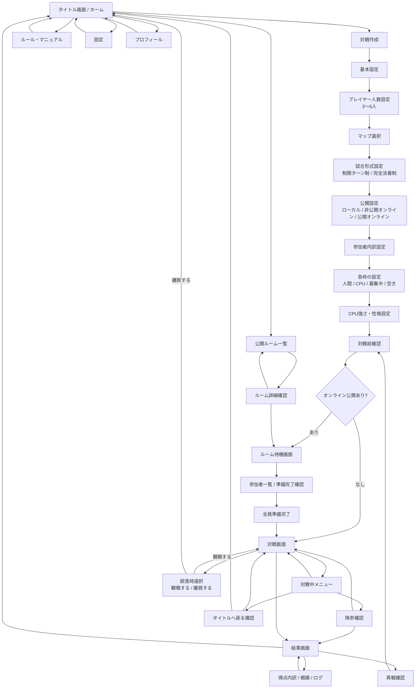

```mermaid
flowchart TD

    A[タイトル画面 / ホーム] --> B[対戦作成]
    A --> M[ルール・マニュアル]
    A --> N[設定]
    A --> O[プロフィール]

    M --> A
    N --> A
    O --> A

    %% 対戦作成
    B --> C[基本設定]
    C --> C1[プレイヤー人数設定\n3〜5人]
    C1 --> C2[マップ選択]
    C2 --> C3[試合形式設定\n制限ターン制 / 完全決着制]
    C3 --> C4[公開設定\nローカル / 非公開オンライン / 公開オンライン]

    %% 参加者設定
    C4 --> D[参加者内訳設定]
    D --> D1[各枠の設定\n人間 / CPU / 募集中 / 空き]
    D1 --> D2[CPU強さ・性格設定]
    D2 --> E[対戦前確認]

    %% 公開設定による分岐
    E --> F{オンライン公開あり?}

    F -->|なし| G[対戦画面]
    F -->|あり| H[ルーム待機画面]

    H --> H1[参加者一覧 / 準備完了確認]
    H1 --> H2[全員準備完了]
    H2 --> G

    %% ルーム参加
    A --> R[公開ルーム一覧]
    R --> R1[ルーム詳細確認]
    R1 --> H
    R1 --> R

    %% 対戦中
    G[対戦画面] --> G1[対戦中メニュー]
    G1 --> G
    G1 --> S[降参確認]
    G1 --> T[タイトルへ戻る確認]

    S --> G
    S --> J[結果画面]

    T --> G
    T --> A

    %% 脱落
    G --> X[脱落時選択\n観戦する / 離脱する]
    X -->|観戦する| G
    X -->|離脱する| A

    %% 終局
    G --> J[結果画面]
    J --> J1[得点内訳 / 戦績 / ログ]
    J1 --> J

    J --> K[再戦確認]
    K --> E

    J --> A
```
