# シーケンス図 v0.2（簡略版）

この文書は、戦略陣取りゲームの主要処理を、できるだけシンプルな登場人物で表したシーケンス図です。  
v0.1 は実装サービス名を細かく分けすぎていたため、まずはこの v0.2 を読み取り用・仕様共有用の正本とします。

---

## Phase 3-A: 撤退処理シーケンス

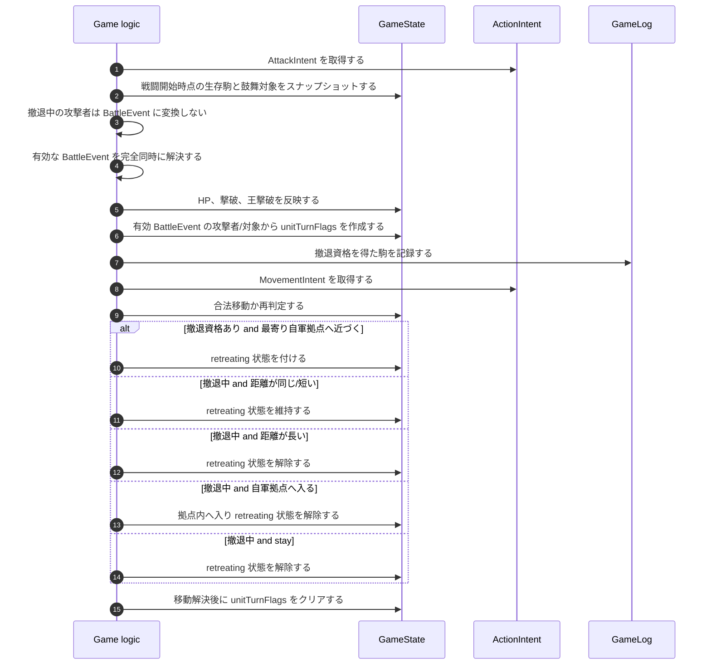

Phase 3-A では、攻撃フェーズで攻撃を選んで撤退解除する処理は実装しない。
撤退解除は移動解決時の stay、遠ざかる合法移動、自軍拠点到達で行う。
撤退中の駒は攻撃不可だが、被攻撃確率補正はまだ発生しない。

撤退資格の参加者一覧は、有効な BattleEvent を確定した直後、命中判定より前に攻撃者と対象者の両方から作る。
このため、攻撃が失敗してダメージが0でも、対象者が戦闘後に生存していれば撤退資格の判定対象になる。
敵拠点3マス以内の判定には、BattleEvent 確定時点の位置を使う。

# 1. この版の方針

## 1.1 登場人物

この版では、登場人物を基本的に以下だけに絞ります。

| 登場人物   | 意味                                                   |
| ---------- | ------------------------------------------------------ |
| プレイヤー | 操作する人                                             |
| 画面       | 盤面UI、ボタン、候補表示など                           |
| ゲーム処理 | ルール判定、移動解決、戦闘解決などを行うアプリ内部処理 |
| 盤面データ | 現在の駒、拠点、橋、障害物、得点などの状態             |
| 入力予定   | 同時行動を解決する前に、一時保存する入力               |
| ログ       | 戦闘結果や水計などの記録                               |
| 乱数       | 攻撃成功判定に使う乱数                                 |

## 1.2 v0.1との違い

v0.1では、以下のような細かい担当を出していました。

- GameEngine
- RuleService
- MovementService
- BattleService
- BaseService
- BridgeService
- ScoreService

これは実装詳細に寄りすぎています。  
学習・仕様理解段階では、まず「ゲーム処理」にまとめて構いません。

---

# 2. 全体ターン進行

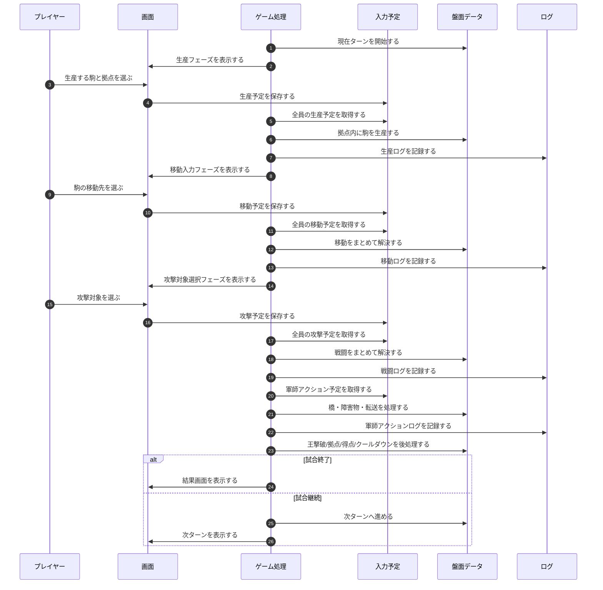

## 日本語で言うと

1ターンの流れを、上から順に示した図です。  
重要なのは、プレイヤーが入力した瞬間に盤面を変えるのではなく、まず `入力予定` に保存し、フェーズ解決時にまとめて `盤面データ` を更新することです。

---

# 3. 生産処理

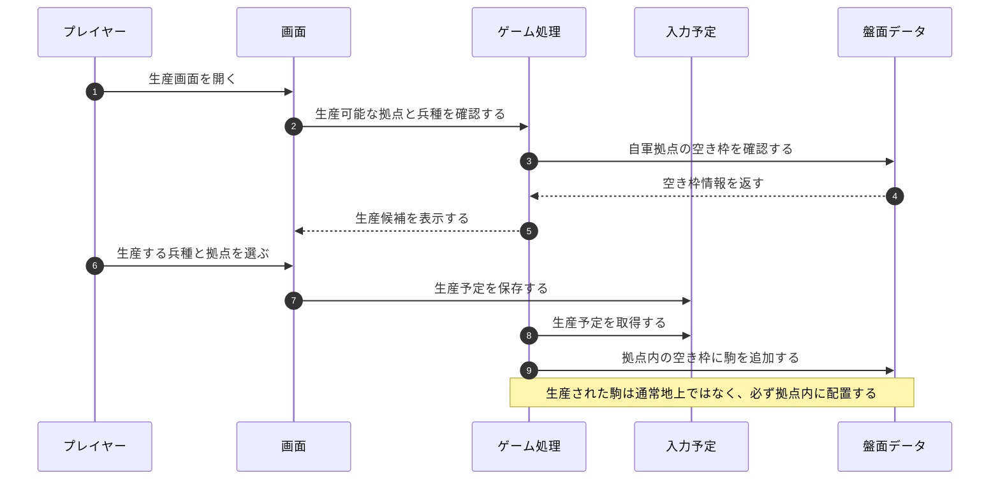

---

# 4. 移動入力

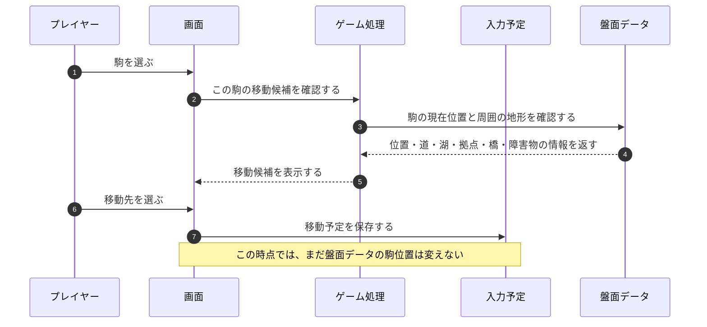

---

# 5. 移動解決

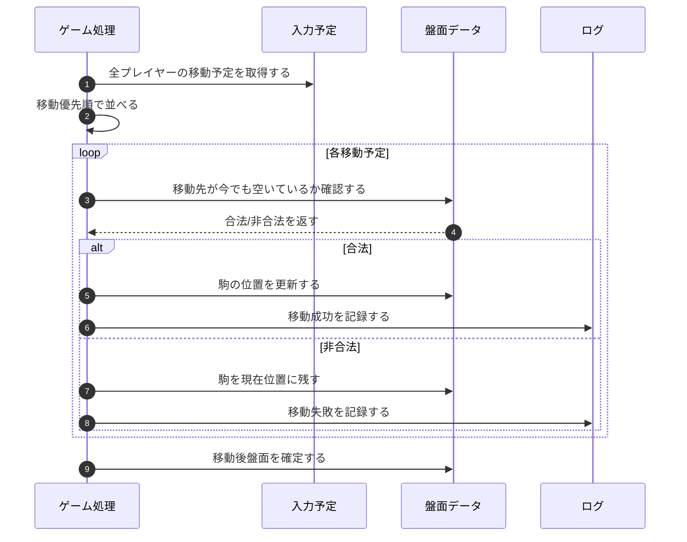

## 日本語で言うと

全員の移動予定をまとめて取り出し、優先順で1つずつ処理します。  
入力時には合法だった移動でも、他の駒の移動結果によって移動先が埋まる可能性があるため、解決時に再判定します。

---

# 6. 攻撃対象選択

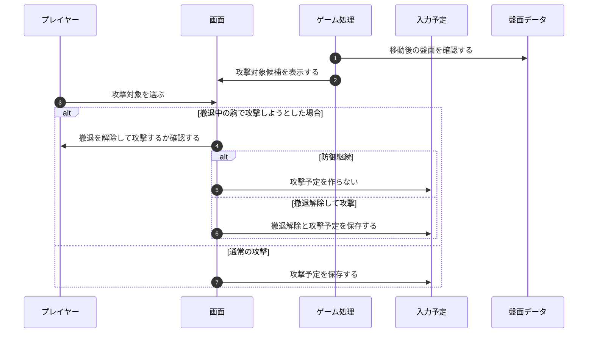

## 日本語で言うと

攻撃対象は、移動前ではなく移動解決後の盤面を見て選びます。  
撤退中の駒は攻撃できないため、攻撃する場合は撤退解除を選ばせます。

---

# 7. 戦闘解決

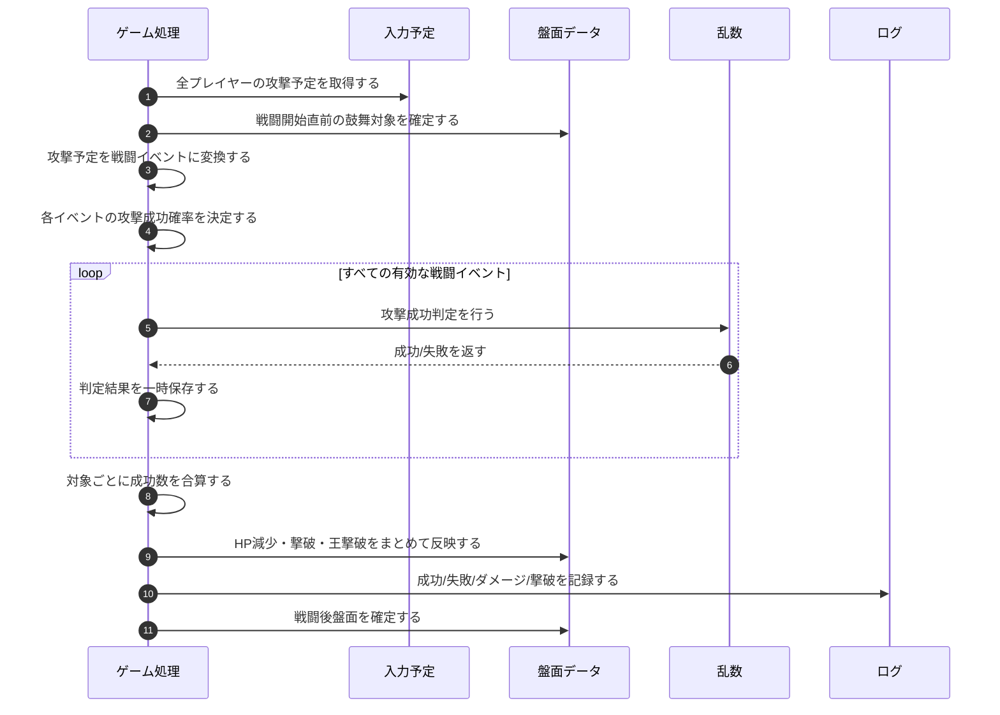

---

# 8. 拠点攻撃と奥座敷

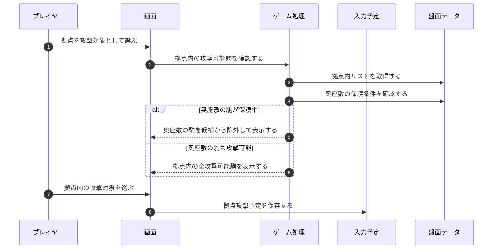

---

# 9. 撤退処理

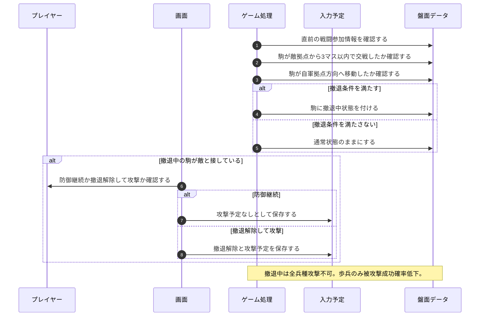

---

# 10. 橋リセットと水計

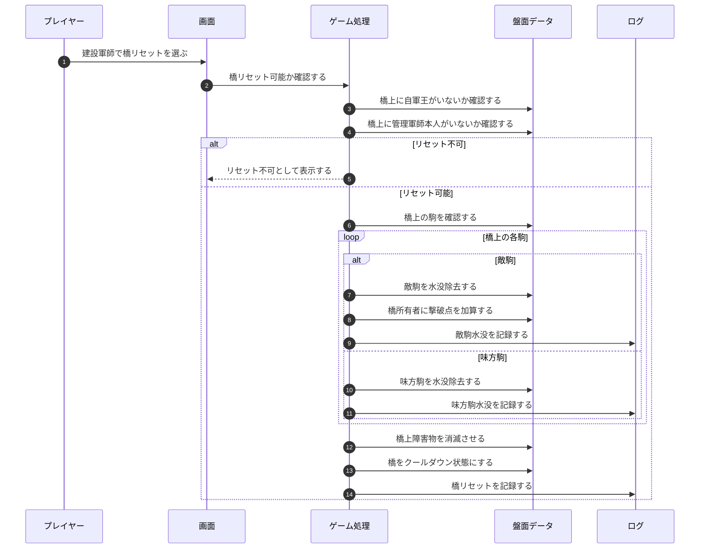

---

# 11. 後処理と試合終了判定

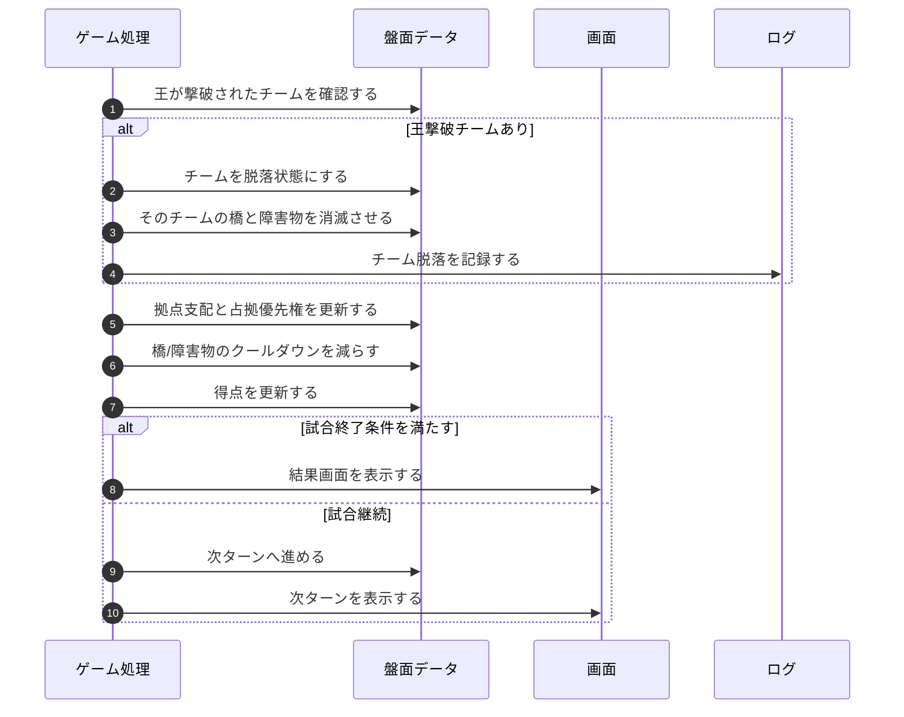

---

# 12. 補足

## 12.1 この簡略版で十分な理由

実装初期では、`RuleService` や `BattleService` のような細かい担当を図に出さなくてもよいです。  
まずは、以下の区別ができていれば十分です。

- 画面が受け取る
- 入力予定に保存する
- ゲーム処理がまとめて解決する
- 盤面データを更新する
- ログに残す

## 12.2 実装が進んだら分けるもの

将来的に処理が複雑になったら、以下を内部サービスとして分けてもよいです。

| 簡略版     | 詳細実装で分けるなら |
| ---------- | -------------------- |
| ゲーム処理 | GameEngine           |
| ゲーム処理 | MovementService      |
| ゲーム処理 | BattleService        |
| ゲーム処理 | BaseService          |
| ゲーム処理 | BridgeService        |
| ゲーム処理 | ScoreService         |

ただし、最初から全部を図に出すと読みにくくなるため、この簡略版ではまとめています。
# 占領シーケンス追補

守備隊全滅: `battle_resolution → capture_resolution相当処理 → 所有権移転・要求生成 → reward_placement → 全要求完了/失効 → 次通常フェーズ`。

戦闘中放棄: `movement_resolution → 放棄検出 → capture_resolution相当処理 → 即時所有権移転・要求生成 → reward_placement → 全要求完了/失効 → attack_input`。後入城待ちは行わない。

単純放棄への入城: `movement_resolution → 所有権移転 → attack_input`。褒賞配置要求は生成しない。
