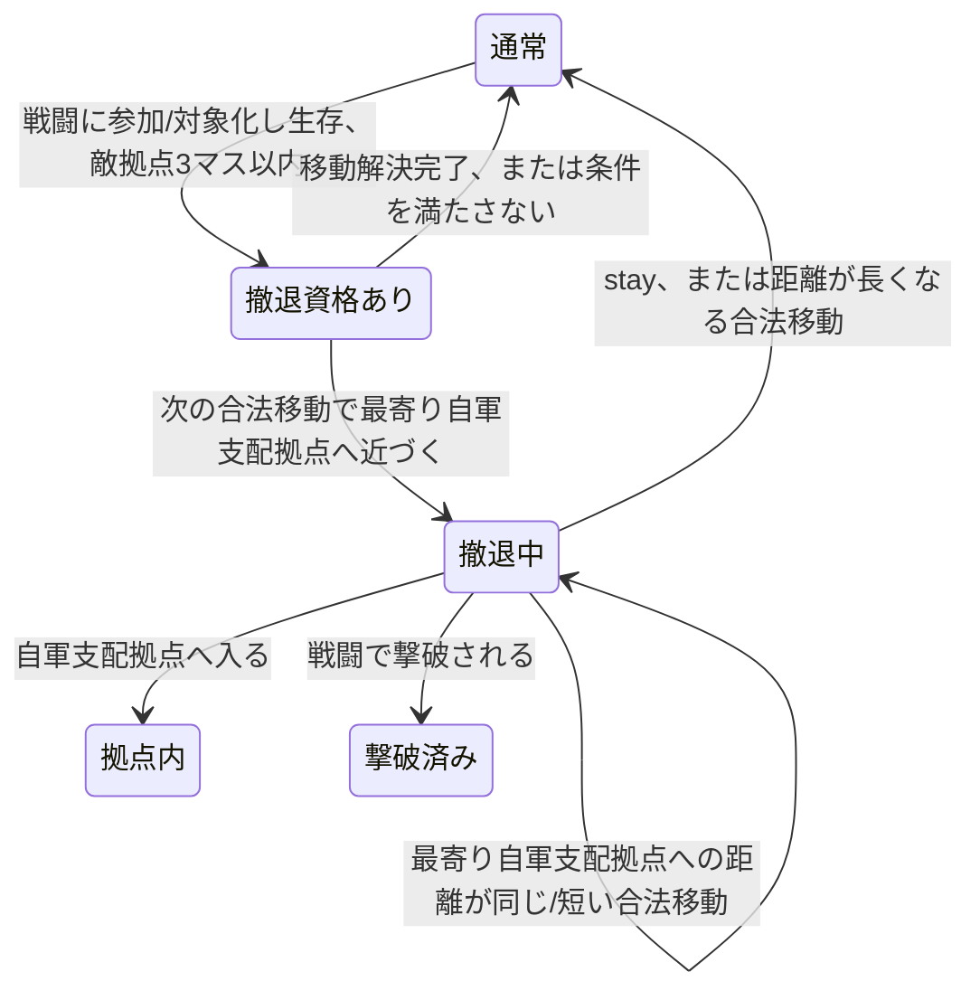
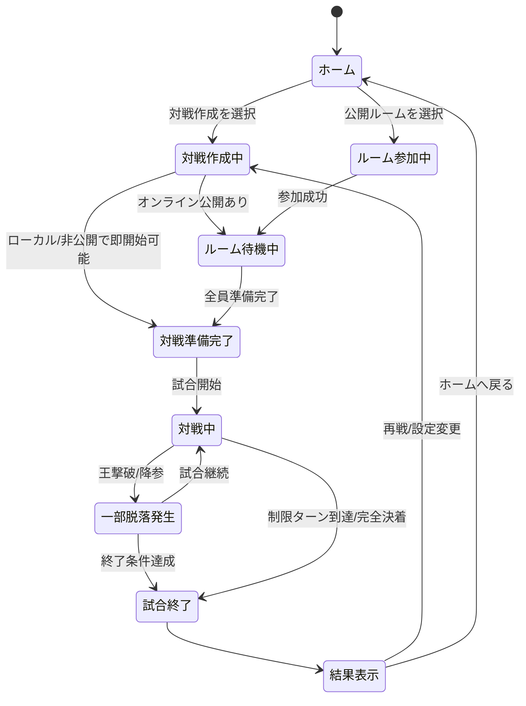
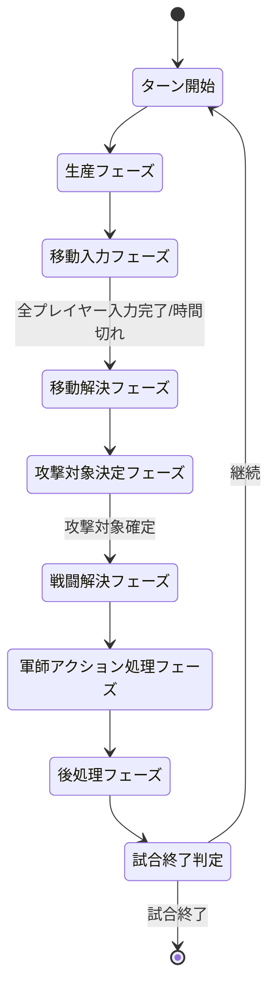
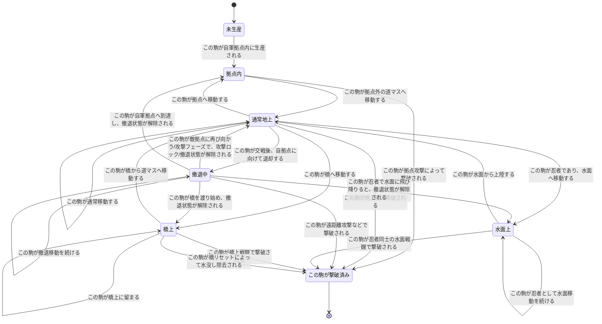
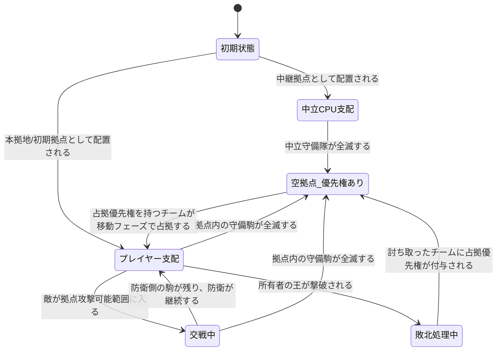
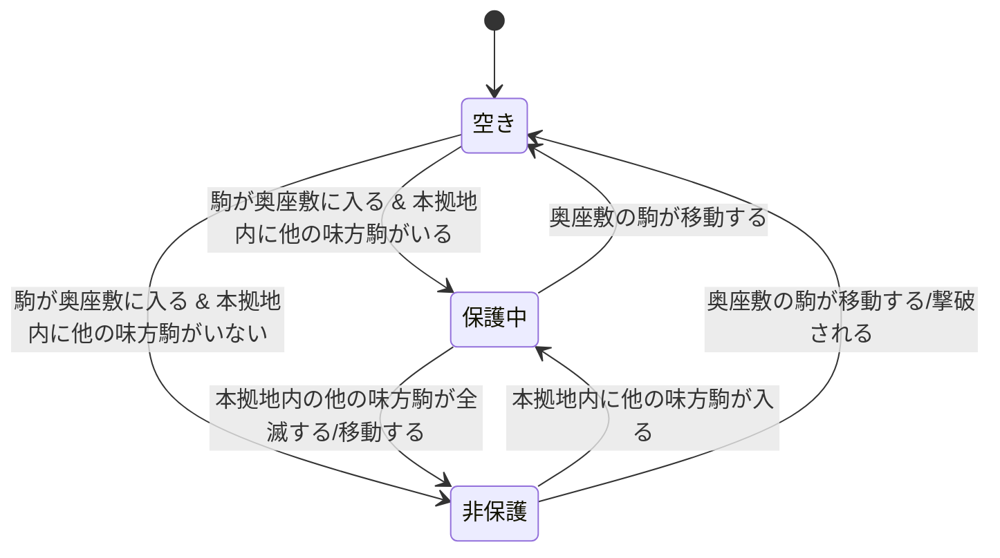
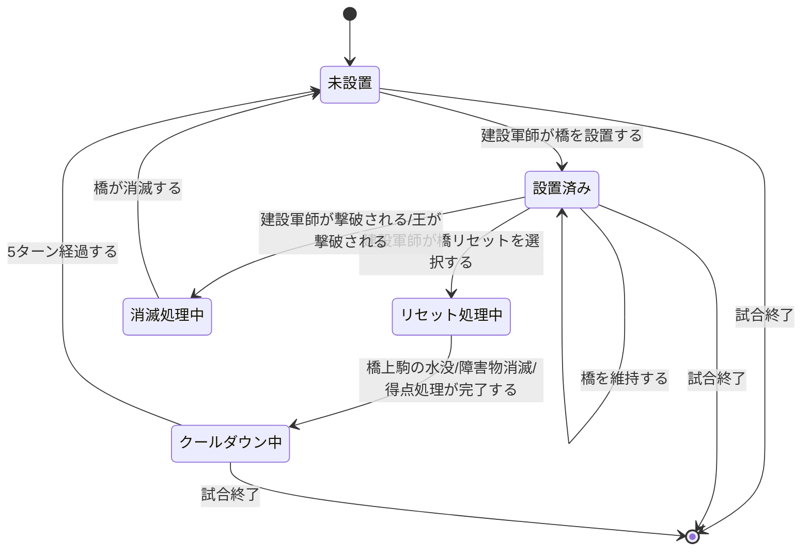
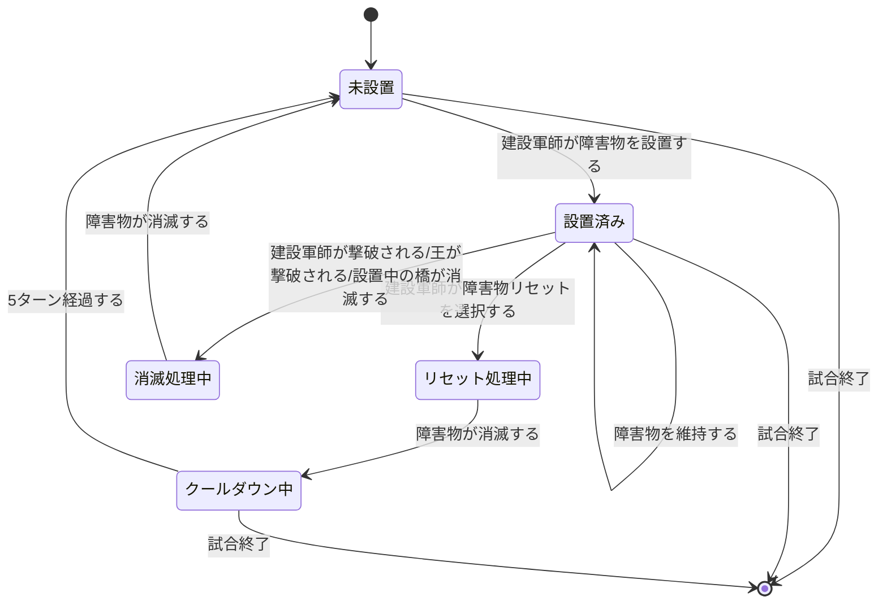
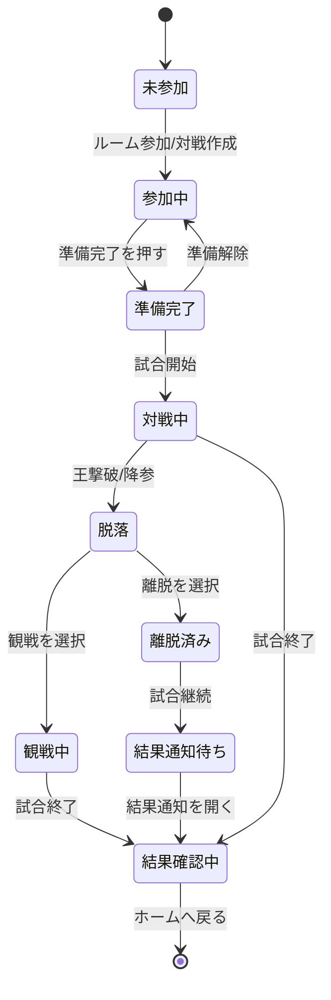

# 状態遷移図まとめ v0.1

このファイルは、戦略陣取りゲームの実装前設計として、状態遷移図を Mermaid 記法でまとめたものです。

## 使い方

- VSCode で開き、Mermaid 対応の Markdown Preview 拡張を使うと図として確認できます。
- Git 管理しやすいように、画像ではなく Mermaid 記法で記述しています。
- 今後仕様が固まるたびに、このファイルを更新していく前提です。

---

## Phase 3-A: 撤退状態遷移の実装メモ

撤退は歩兵専用ではなく、全兵種に発生し得る。
水面上、拠点内、removed 状態の駒は撤退資格を得ない。
Phase 3-A では撤退中の防御確率補正は未実装であり、攻撃成功確率表は変更しない。

# 1. ゲーム全体の状態遷移図

---

# 2. ターン/フェーズの状態遷移図

## 補足

- 軍師の橋・障害物の設置/リセットは、戦闘解決後の軍師アクション処理フェーズで行う。
- 軍師死亡・王死亡による橋/障害物の消滅も、戦闘解決後から後処理フェーズにかけて処理する。
- 次の移動フェーズへスムーズに入るため、橋/障害物関連の状態更新は後処理フェーズまでに完了させる。

---

# 3. 駒の状態遷移図

## 補足

- 生産された駒は、必ず自軍拠点内の空き枠に配置される。
- 撤退は歩兵の行動状態であり、通常地上から撤退中へ遷移する。
- 撤退中の歩兵が自軍拠点へ到達すると、拠点内へ入り、撤退状態が解除される。
- 「撃破済み」は、この状態遷移図の対象である駒自身が撃破・除去されたことを意味する。
- 水面上へ移動できるのは通常忍者のみである。
- 水面上の忍者は攻撃不可・兵種入れ替え不可・拠点占拠不可。ただし上陸後は通常地上の駒として扱う。
- 橋上の駒は、橋上戦闘または橋リセットによる水計で除去され得る。

---

# 4. 拠点の状態遷移図

## 補足

- 拠点内の駒は内部リスト扱いとする。
- 通常拠点は最大4体を保持できる。
- 拠点に接している、または射程内に拠点が入っている場合、拠点内の敵駒を攻撃対象にできる。
- 拠点は攻撃判定上「大きな1マス」として扱う。
- 拠点を挟んで反対側の外部駒を攻撃することはできない。
- 占拠優先権を持つチームのみが、その拠点を移動フェーズで占拠できる。

---

# 5. 本拠地奥座敷の状態遷移図

## 補足

- 本拠地には、奥の1マスに相当する保護枠が1つ存在する。
- 奥座敷にいる駒は、本拠地内に他の味方駒が存在する限り、敵の攻撃対象に選ばれない。
- 奥座敷にいる駒だけが本拠地内に残った場合、その駒は攻撃対象になる。
- 奥座敷の駒が攻撃しても、保護状態は解除されない。
- 王を置くことを想定するが、弓兵など他の駒を置くことも可能。

---

# 6. 橋の状態遷移図

## 補足

- 橋は建設軍師によって設置される。
- 橋はマップ上で指定された同一湖内の直線区間にのみ設置できる。
- 橋は縦または横一直線のみで、斜めには設置できない。
- 橋は敵味方を問わず通行可能。
- 橋上の駒は攻撃でき、また攻撃対象にもなる。
- 忍者は橋を水面として横切れず、橋から上陸することもできない。
- 橋を別の場所へ動かす場合、即再設置ではなく、まず現在の橋をリセット消去する。
- 橋リセット後は5ターンのクールダウンに入る。
- クールダウン終了後に再度未設置状態となり、新しい橋を設置可能になる。
- 橋リセット時、橋上の敵駒は水没し、橋所有者側の撃破点になる。
- 橋リセット時、橋上の味方駒も水没するが、敵にも自軍にも撃破点は入らない。
- 敵王が橋上にいる場合、橋リセットによって撃破可能。
- 自軍王または橋を管理する建設軍師本人が橋上にいる場合、橋リセットは選択不可とする。
- 橋を管理する軍師が撃破された場合、またはそのチームの王が撃破された場合、橋は消滅する。
- 軍師死亡や王死亡による橋消滅は、戦闘解決後の後処理で行う。

---

# 7. 障害物の状態遷移図

## 補足

- 障害物は建設軍師によって設置される。
- 障害物は移動と近接攻撃を妨げる。
- 弓兵・工兵隊などの遠距離攻撃は障害物を越えて行える。
- 障害物は道マスまたは橋上に設置できる。
- 敵の橋上にも障害物を設置できる。
- 障害物を別の場所へ動かす場合、即再設置ではなく、まず現在の障害物をリセット消去する。
- 障害物リセット後は5ターンのクールダウンに入る。
- 橋上の障害物は、その橋が消滅した場合に一緒に消滅する。
- 橋のクールダウンと障害物のクールダウンは別管理とする。
- 障害物を管理する軍師が撃破された場合、またはそのチームの王が撃破された場合、障害物は消滅する。

---

# 8. プレイヤー状態遷移図

## 補足

- プレイヤーは王撃破または降参によって脱落する。
- 脱落後は観戦するか、離脱するかを選択できる。
- 観戦中は公開情報を確認できる。
- 離脱した場合でも、試合終了後に結果通知を確認できる。
# 攻略・褒賞状態遷移追補

攻略状態は最初の有効攻撃で開始し、有効攻撃・守備駒撃破で更新される。最後の有効攻撃から10ターン無攻撃、または所有者変更で終了・全リセットする。守備駒損失前の全退城は単純放棄、損失後かつリセット前の全退城は戦闘中放棄へ遷移する。

守備隊全滅または戦闘中放棄で配置要求が残る場合、通常フェーズから `reward_placement` へ遷移する。全要求が `completed` または `expired` になるまで滞留し、完了後に保存された復帰先（`attack_input` または次の通常進行）へ戻る。

王攻略記録は王の生存中継続し、無攻撃期間では遷移しない。王撃破または所有拠点0で破棄される。単独王撃破は敗北・全拠点継承へ、複数王同時撃破は全対象敗北・拠点中立化へ遷移する。いずれも未完了褒賞があれば `reward_placement` で通常進行を遮断する。
